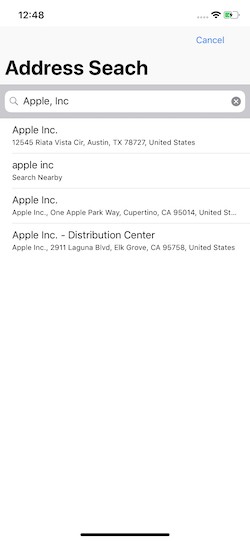

# AddressSearch

### The Goal
We build AddressSearch to serve as a convenient reusable method for allowing users to autocomplete their address entry. We wanted to be something that was lightweight and efficient



## Installation

### CocoaPods

[CocoaPods](http://cocoapods.org) is a dependency manager for Cocoa projects. You can install it with the following command:

```bash
$ gem install cocoapods
```

To integrate AddressSearch into your Xcode project using CocoaPods, specify it in your `Podfile`:

```ruby
source 'https://github.com/CocoaPods/Specs.git'
platform :ios, '11.0'
use_frameworks!

target '<Your Target Name>' do
  pod 'AddressSearch'
end
```

## Usage

In the ViewController that you would like to use AddressSearch, import AddressSearch and implement code like the following.

```swift
import UIKit
import AddressSearch

class ViewController: UIViewController, ASDelegate {

  override func viewDidAppear() {
    super.viewDidLoad()

    let addressSearchController = ASViewController.launch()
    addressSearchController.delegate = self
    self.present(addressSearchController, animated: true, completion: nil)
  }

  func addressSelected(data: Dictionary<NSTextCheckingKey, String>) {
    // handle AddressSearch data output here
  }
 }
 ```

## AddressSearch Delegate
```swift
func addressSelected(data: Dictionary<NSTextCheckingKey, String>) {

}
```
